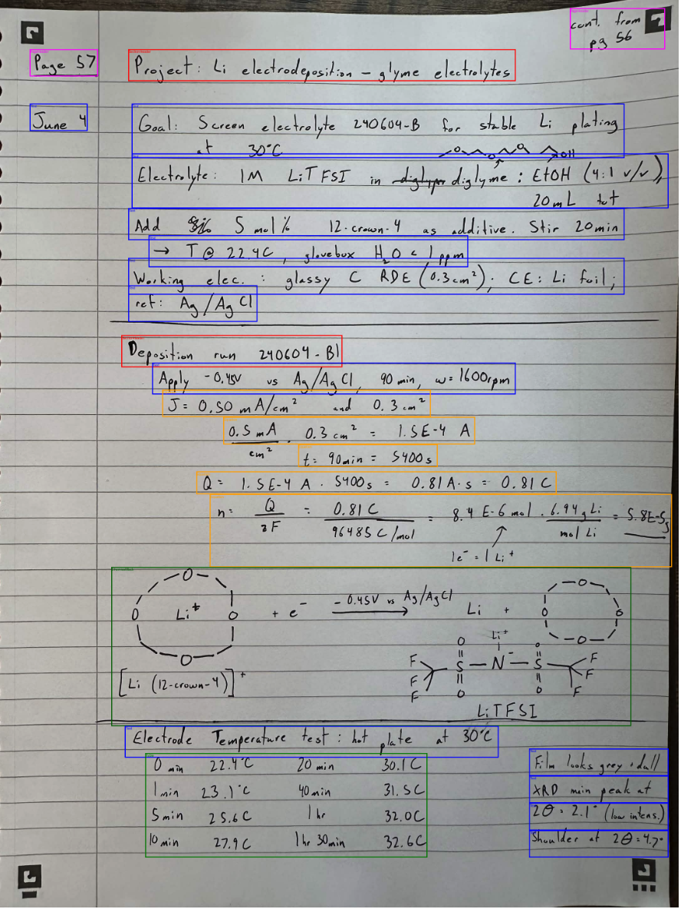

## Approach

### What didn't work

**DocYOLO** — tried first for document region detection. Object detection was not reliable enough on dense, handwritten scientific pages; bounding boxes frequently merged or missed regions entirely.

**PaddleOCR** — attempted as a standalone OCR engine. Performed reasonably on printed text but consistently mangled scientific symbols (°C, λ, sub/superscripts), struggled with handwriting, and produced nothing useful on hand-drawn chemical structures.

### What worked: Surya OCR + per-region VLM

[Surya](https://github.com/VikParuchuri/surya)'s layout model was the breakthrough — it reliably segments a page into typed regions (Text, Table, Equation, SectionHeader, ChemicalBlock, etc.) even on messy lab notebook pages. With clean region crops in hand, a local vision-language model (Qwen3-VL via Ollama) can be prompted specifically for each region type, which dramatically improves accuracy over feeding the whole page at once.

The final structured text is stitched together and passed to a text-only LLM that polishes formatting, fills in contextual gaps, and writes a conclusion summarizing the experiment.

### Pipeline

1. **Surya layout detection** — segments the page into labeled regions (Text, Table, Equation, SectionHeader, ChemicalBlock)
2. **Per-region VLM extraction** — each crop is sent to a local VLM (Qwen3-VL) with a region-type-specific prompt, producing verbatim transcripts, LaTeX equations, Markdown tables, or SMILES structures
3. **Stitch** — regions are sorted top-to-bottom and concatenated into a single Markdown document



### Requirements

**Python dependencies:**
```bash
pip install -r requirements.txt
```

**Ollama** (runs the local VLM and polish models):
```bash
# Install: https://ollama.com
ollama pull qwen3-vl:2b      # vision model — region extraction
ollama pull qwen3.5:4b       # text model  — polish + conclusion
```

**pdflatex** (for PDF compilation):
```bash
# macOS
brew install --cask mactex-no-gui
# Ubuntu
sudo apt install texlive-latex-base
```

### Output

The final structured report is [`final_lab_report.pdf`](final_lab_report.pdf).

### Running

```bash
python main.py "Example Lab Notebook Page.jpg"

# Optional flags
python main.py image.jpg \
  --vlm-model qwen3-vl:2b \
  --polish-model qwen3.5:4b \
  --output-md out.md \
  --output-pdf out.pdf \
  --annotated-image layout.png \
  --skip-polish \
  --skip-pdf
```
